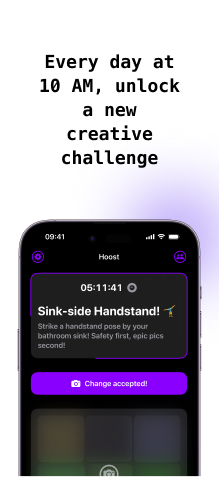
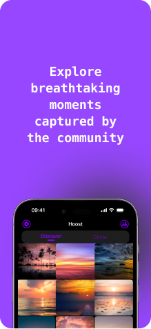
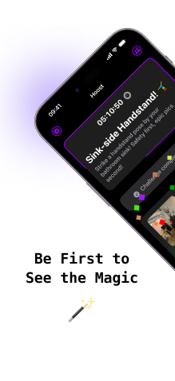
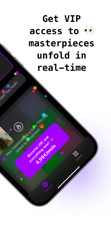
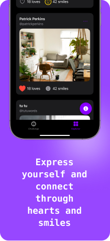

# Hoost

&nbsp;

&nbsp;

&nbsp;

&nbsp;

## 🎯 Overview

This project demonstrates how to combine product vision, engaging user experience, and technical efficiency to create a photo-sharing application with strong commercial potential. Road to 1B$ ARR 🚀

## 📱 Product Design & Ideation

To understand the brainstorming process:
👉 [View Ideas](docs/ideas.md)

To understand the application concept, user needs analysis and business model:
👉 [View Product Design Documentation](docs/product-design.md)

## 🔄 Core Loop

To understand the primary engagement loop driving the product:
👉 [View Core Loop Documentation](docs/core-loop.md)

## ⚙️ Technical Architecture

To discover our technical choices and implementation details:
👉 [View Technical Documentation](docs/technical-decisions.md)

## 📱 App Description

Hoost is your daily creative companion, transforming photo sharing into an exciting community adventure. Every day at 10:00 AM GMT, discover a new creative challenge that sparks your imagination - from artistic breakfast shots to epic sunset captures.

What makes Hoost unique? It's not about likes or endless scrolling. Instead, join a vibrant community where each photo contribution becomes part of a beautiful collective mosaic, revealed the next day. See your friends' submissions first, making each reveal personal and meaningful.

With our Golden Hour premium subscription, get exclusive real-time access to see how the community mosaic builds throughout the day. Want to keep these memories forever? Order physical prints of your favorite mosaics to showcase your creative journey.

Simple, engaging, and focused on authentic creativity - Hoost brings back the joy of sharing moments that matter.

Join our growing community of creative minds and make every day a new opportunity to express yourself! 🎨 📸 ✨

## 🔨 Future Improvements

### Code Architecture
- Extract shared components (NetworkClient, HapticManager) into separate packages
- Implement a proper dependency injection system (not totally done in some cases)

### Constants & Configuration
- Centralize UI constants (sizes, colors, margins) in a dedicated Theme system
- Move animation durations to a single configuration file
- Extract API keys and sensitive data to a secure configuration

### Localization
- Implement a proper localization system
- Extract all hardcoded strings to localization files
- Add language selection in settings

### Testing
- Add unit tests coverage (the architecture is ready for it ✅)

### Features
- Reveal the mosaic in real-time
- Give the user the ability to order physical prints of their favorite mosaics

---
*This project is a prototype developed as part of Voodoo's technical assessment process.*